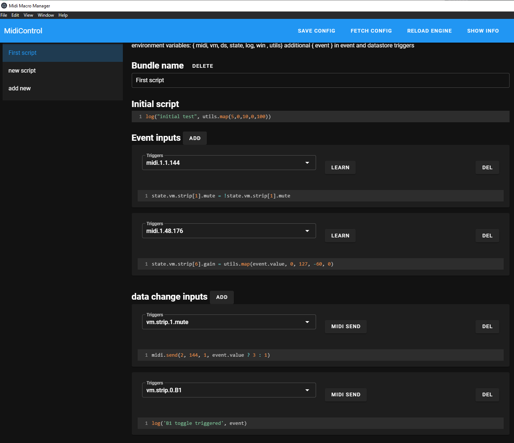

# Midi Control
## MIDI controller -> Macro mapper

Features:
- Define javascript code that can activate via midi, internal state or voicemeeter events
- Supports voicemeeter up to potato (API incomplete, currently only strip and bus getters and setters, recorder and effect control possibly soon)

Example use cases:
- Improved control of voicemeeter, bind returns to MIDI controllers that can have feedback, like changing lights or moving motorized faders
- Define buttons to do multiple things simultaneously, for example a button to set multiple strip and bus gains, set routing, etc
- Run any script you could want triggered by state change or press of a button, currently the sandbox where snippets are run in is pretty restrictive but in light of any api needs for scripts like http request access or other api interfaces (OBS for example) can be easily implemented

### application in action

noteworthy info:
- midi message headers for debug: http://www.4front-tech.com/pguide/midi/midi5.html

